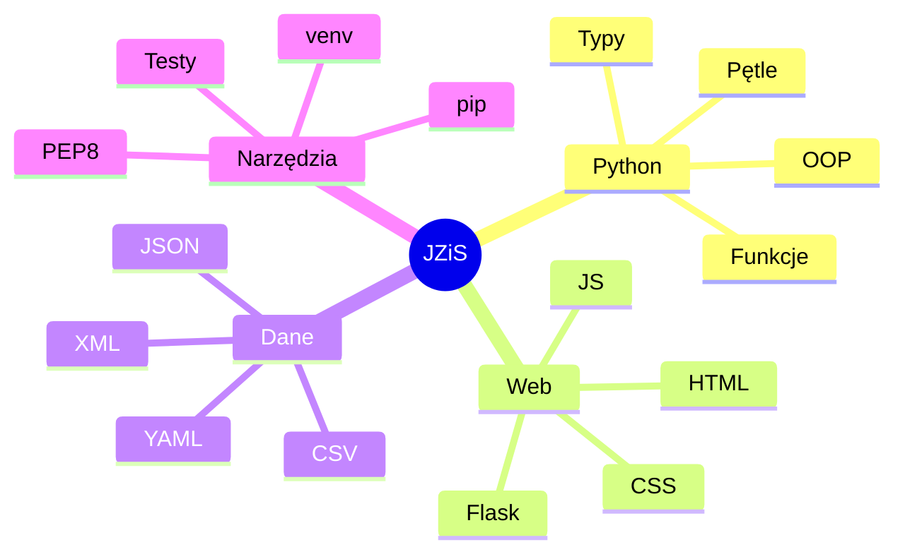

# Wykład 15: Dobre praktyki, styl kodu i podsumowanie

## 1. PEP 8 – Styl kodu w Pythonie
PEP 8 (Python Enhancement Proposal 8) to oficjalny przewodnik po stylu kodowania w Pythonie. Jego celem jest poprawa czytelności kodu.

### Kluczowe zasady:
- **Wcięcia:** 4 spacje (nie tabulatory).
- **Długość linii:** Maksymalnie 79 znaków.
- **Nazewnictwo:**
    - Funkcje i zmienne: `snake_case`.
    - Klasy: `PascalCase` (lub `CapWords`).
    - Stałe: `UPPER_CASE_WITH_UNDERSCORES`.
- **Importy:** Zawsze na początku pliku, pogrupowane (standardowe, zewnętrzne, lokalne).

## 2. Dokumentowanie kodu (Docstrings)
Dobre funkcje i klasy powinny zawierać opisy zawarte w potrójnym cudzysłowie.

```python
def oblicz_podatek(kwota, stawka=0.23):
    """
    Oblicza wartość podatku VAT dla podanej kwoty.

    Args:
        kwota (float): Kwota netto.
        stawka (float): Stawka podatku (domyślnie 0.23).

    Returns:
        float: Wartość podatku.
    """
    return kwota * stawka
```

## 3. Zasada Zen Pythona
Możesz ją wyświetlić w konsoli wpisując `import this`. Główne założenia:
- Piękne jest lepsze niż brzydkie.
- Wyraźne jest lepsze niż domyślne.
- Proste jest lepsze niż złożone.
- Czytelność ma znaczenie.

## 4. Testowanie kodu (Podstawy)
Testy jednostkowe pomagają upewnić się, że kod działa poprawnie po wprowadzeniu zmian.

```python
# Przykład prostego testu przy użyciu assert
def suma(a, b):
    return a + b

assert suma(2, 2) == 4
assert suma(-1, 1) == 0
print("Wszystkie testy przeszły!")
```

## 5. Podsumowanie kursu
W trakcie tego kursu poznaliśmy:
1.  **Fundamenty programowania** w Pythonie (typy, pętle, funkcje).
2.  **Paradygmat obiektowy** (klasy, dziedziczenie).
3.  **Języki znaczników** i prezentacji treści (Markdown, HTML, CSS).
4.  **Wymianę danych** (JSON, XML, CSV, YAML).
5.  **Tworzenie aplikacji webowych** (Flask, JavaScript).
6.  **Profesjonalne narzędzia** (pip, venv, dobre praktyki).

### Diagram: mapa pojęć kursu


### Co dalej?
- Eksploracja bibliotek do nauki o danych: **Pandas**, **Matplotlib**.
- Tworzenie bardziej zaawansowanych stron w **Django**.
- Automatyzacja zadań systemowych.
- Nauka systemów kontroli wersji: **Git**.
