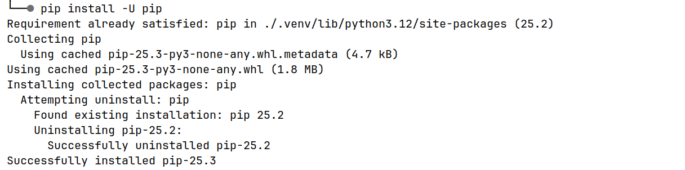

## I. Dokumentacja do lab. nr 1 - "Środowisko pracy i podstawy Pythona"
## II. Imię i nazwisko - grupa ABC, semestr III
## III. Przedmiot - "Języki znaczników i skryptowe"

## IV. Opis zadania do realizacji
Do zrealizowania były następujące zadania:  
  - utworzenie wirtualnego środowiska `venv` i jego aktywacja,
  - instalacja bibliotek zewnętrznych za pomocą menadżera pakietów `pip`,
  - stworzenie i uruchomienie skryptu `hello.py`,
  - generowanie i praca z plikiem `requirements.txt`.

## V. Technologie wykorzystane w zadaniu
  - Python 3.x,
  - venv,
  - pip

## VI. Realizacja zadania
<br>

#### 1. Kod skryptu hello.py
W zadaniu utworzono prosty skrypt wypisujący tekst w konsoli.

Kod wykorzystany do rozwiązania zadania:  

```python
print("Witaj w Pythonie")
```

#### 2. Zrzuty ekranu pokazujące wynik działania aplikacji/skryptu:  


#### 2a. Struktura projektu/programu:  


<br>

## III. Dodatkowe informacje o zadaniu
Można tu wpisać informacje o elementach, które nie zostały wymienione we wcześniejszych punktach.

#### 1. Komendy terminala
Przykładowe komendy użyte podczas laboratorium:
```bash
python -m venv venv
source venv/bin/activate
pip install requests
pip freeze > requirements.txt
```

#### 2. Linki
  - do stron: [Python venv documentation](https://docs.python.org/3/library/venv.html)
<br>
  
#### 3. Inne
  - wpisujemy informacje dotyczące zadania, które uważamy za istotne,  
  - ...